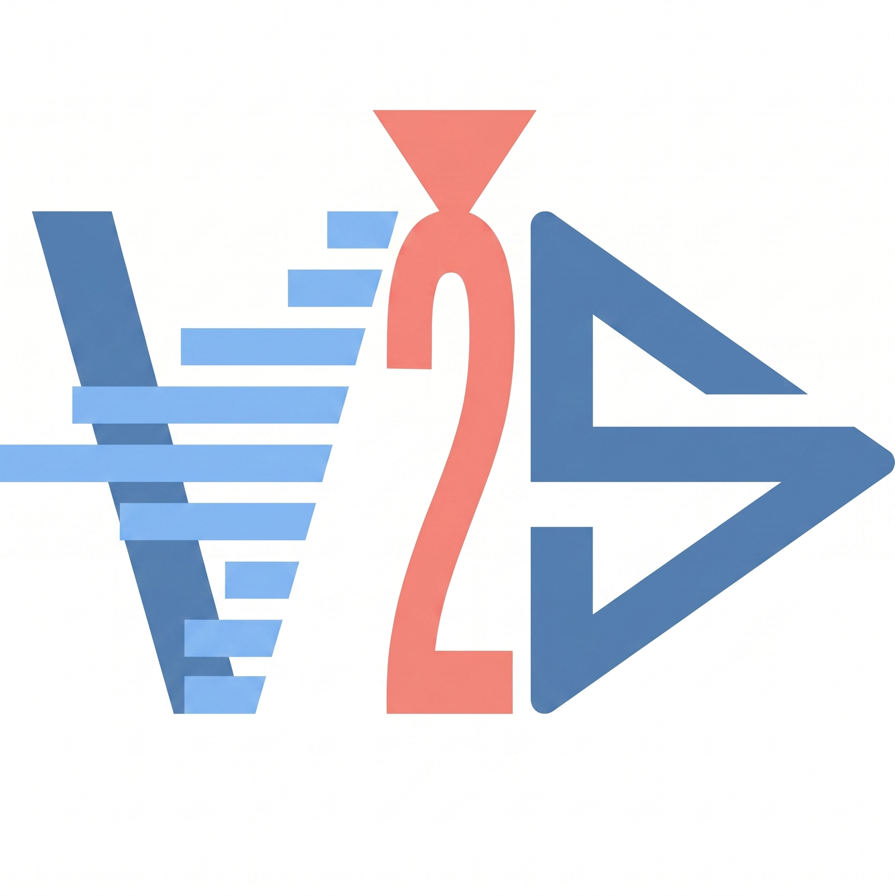

<div align="center">
  
  <h1>🎙️ V2S — Voice & Subtitle Toolkit</h1>

  [](#)
  [](#)
  [](#)
  [](#)

  <p><em>A lightweight, modular Python toolkit bridging the gap between text, speech, and synchronized captions.</em></p>
</div>

---

> **🤖 Note:** This project was heavily developed with the assistance of AI agents.

V2S is a lightweight, modular Python toolkit designed to bridge the gap between text, speech, and synchronized captions. **Conceived primarily as a companion for Kdenlive users**, it provides a streamlined workflow for generating high-quality audio and precise subtitles that integrate perfectly into non-linear video editors.

## 🌟 Features

- **Text-to-Speech (TTS):** Generate highly realistic speech from text using state-of-the-art TTS engines like **XTTS** and **StyleTTS2**.
- **Transcription (Whisper):** Automatically transcribe audio files and generate precise word-level timings using OpenAI's Whisper models.
- **Subtitle Generation (ASS):** Create visually appealing subtitles with customizable ASS effects (e.g., 'pop', 'fade') **optimized for Kdenlive's subtitle handling**.
- **Audio Splitting:** Easily split audio files based on silences and pauses.
- **All-in-One Pipeline:** A seamless command (`all`) that takes text, synthesizes it into speech, and automatically generates synchronized styled subtitles in one go.

## 🎨 Identity & Integration

The V2S project is deeply rooted in the open-source creative ecosystem:
- **Kdenlive First:** Every feature is tested to ensure that the generated `.ass` files and audio tracks work seamlessly within Kdenlive.
- **Logo:** The project's visual identity is a tribute to Kdenlive, reflecting its purpose as a specialized extension for voice and subtitle workflows within the editor.

## 📦 Requirements

V2S relies on powerful machine learning tools. Ensure you have the required dependencies listed in `requirements.txt`:

- `torch`
- `TTS` (Coqui TTS for XTTS)
- `styletts2`
- `openai-whisper`
- `phonemizer`

## 🛠️ Installation

```bash
# Clone the repository
git clone https://github.com/AlvaroHoux/v2s.git
cd v2s

# Install the necessary dependencies
pip install -r requirements.txt
```

## 🚀 Usage

V2S provides a straightforward Command-Line Interface (CLI). Below are the main commands available:

### 1. Text-to-Speech (`tts`)
Convert text to speech using your preferred engine.
```bash
python -m v2s tts "Hello world, this is a test." --engine styletts2 -l en -v voice_name
```

### 2. Transcribe (`transcribe`)
Transcribe an audio file and extract timestamps.
```bash
python -m v2s transcribe audio.wav -m base -l en
```

### 3. Styled Subtitles (`ass`)
Generate rich ASS subtitles from an audio file. Supports built-in or custom effects.
```bash
python -m v2s ass audio.wav --effect pop
```

### 4. Split Audio (`split`)
Split an audio file into smaller segments.
```bash
python -m v2s split audio.wav
```

### 5. Complete Pipeline (`all`)
Run the complete pipeline: text -> speech -> transcription -> subtitles.
```bash
python -m v2s all "Your text goes here." -e xtts --effect fade
```
